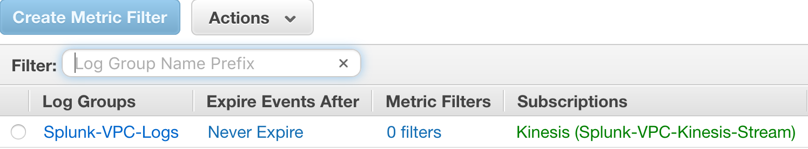

Virtual Hardware Used:
- t2.medium with AWS App + AWS App Add-on

Few notes:

- When running this script, you may have to wait a few minutes for the VPC Flow logs to generate inside of the Cloudwatch stream.
- The Splunk instance is also using the IAM Role (should be autodiscovered) set up during setup for the AWS Splunk app.

Preview of the kinesis stream subscribed to the cloudwatch log group

A few minutes after the script has ran, add a kinesis input under the AWS-Add on add.

If all is good, you should see some events in Splunk under the AWS App -> VPC Flow Logs - Traffic Analysis

